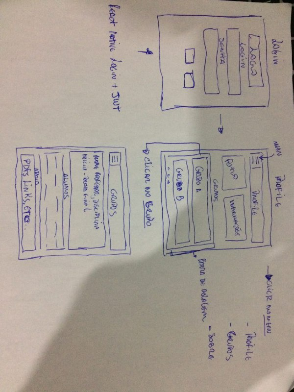

# Front end IF ONLINE

Primeira versão do app, inicialmente com três views:

 0 - Login: 

- Usuário informa login e senha se já for cadastrado, se não deve realizar o cadastro, após confirmação de email.

 1 - Profile: 

- Informações básicas do usuário logado como, nome, email, matricula, data nascimento, etc...
- Informações sobre os grupos que o usuário parcitipa.

 2 - Grupos 

- Inicialmente vamos ter duas abordagens a primeira, é uma listagem de grupos por usuário e a segunda uma lista com todos os grupos.
- Ao selecionar um grupo vamos ter informações como, nome professor, disciplina, nome e email dos alunos do grupo, pdfs e links relacinados.  

